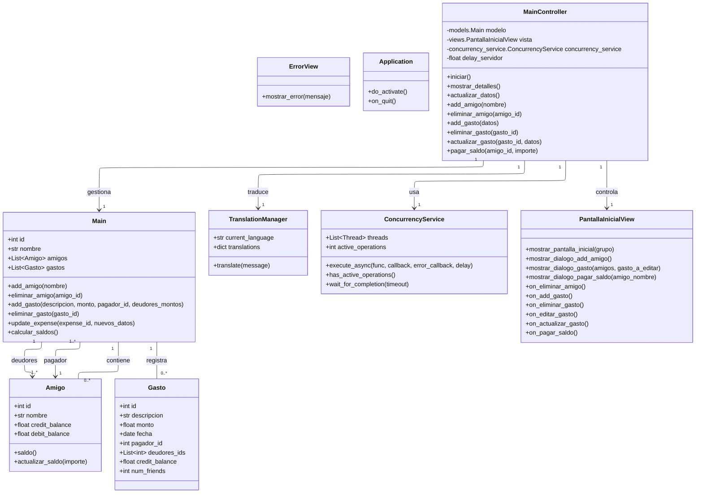
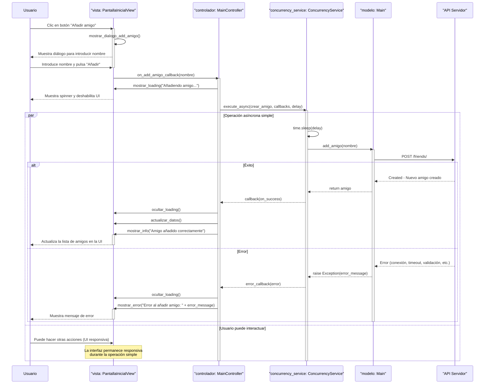
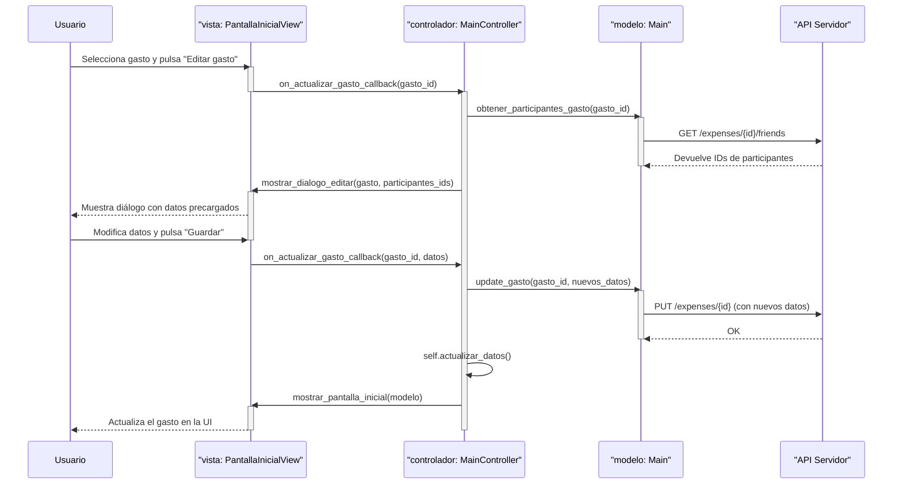
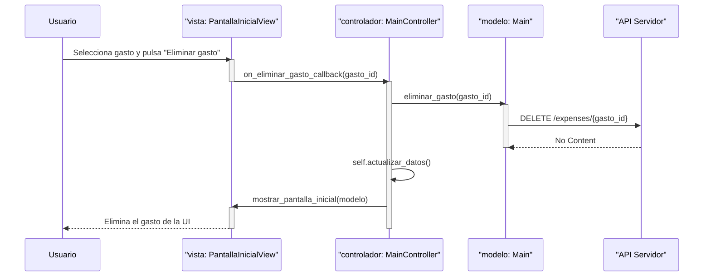
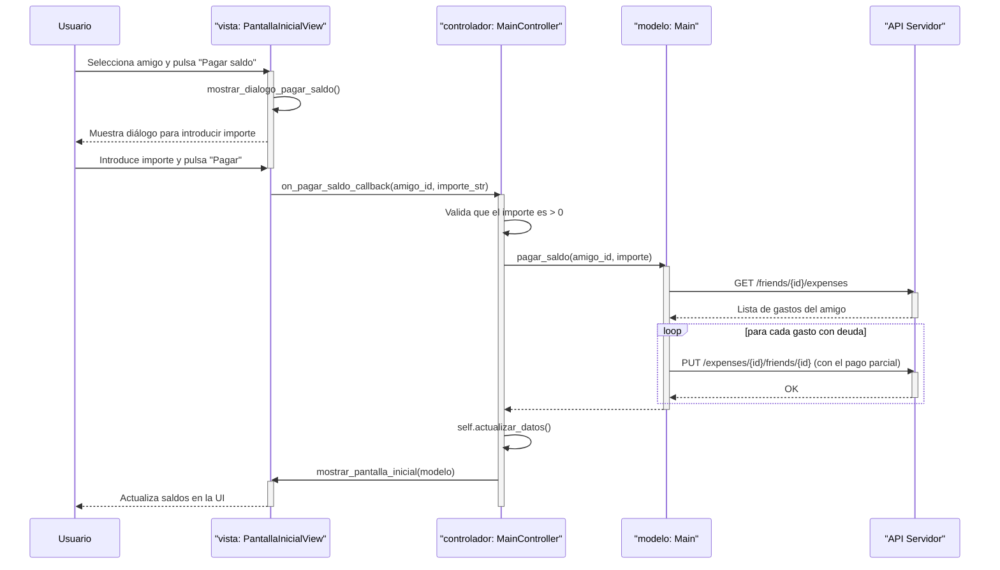
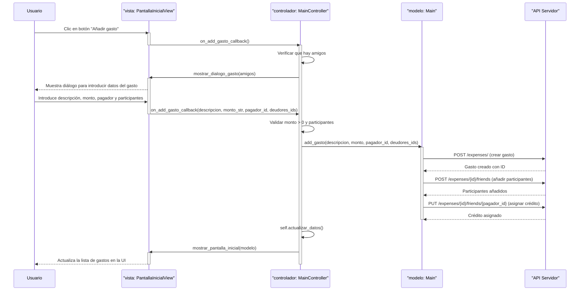
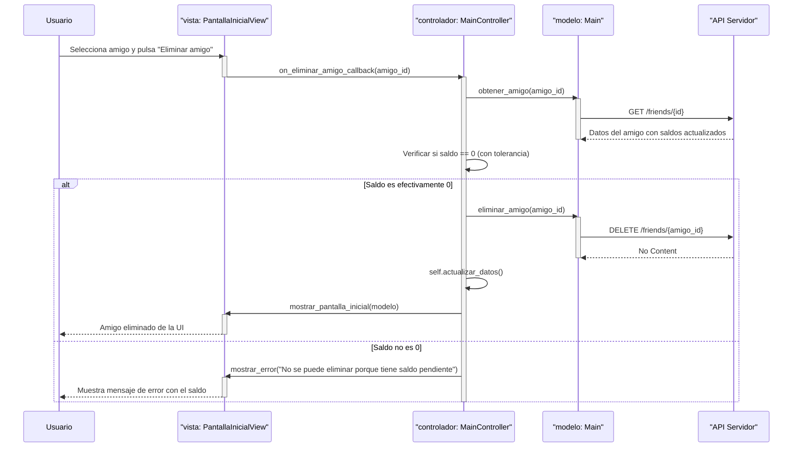
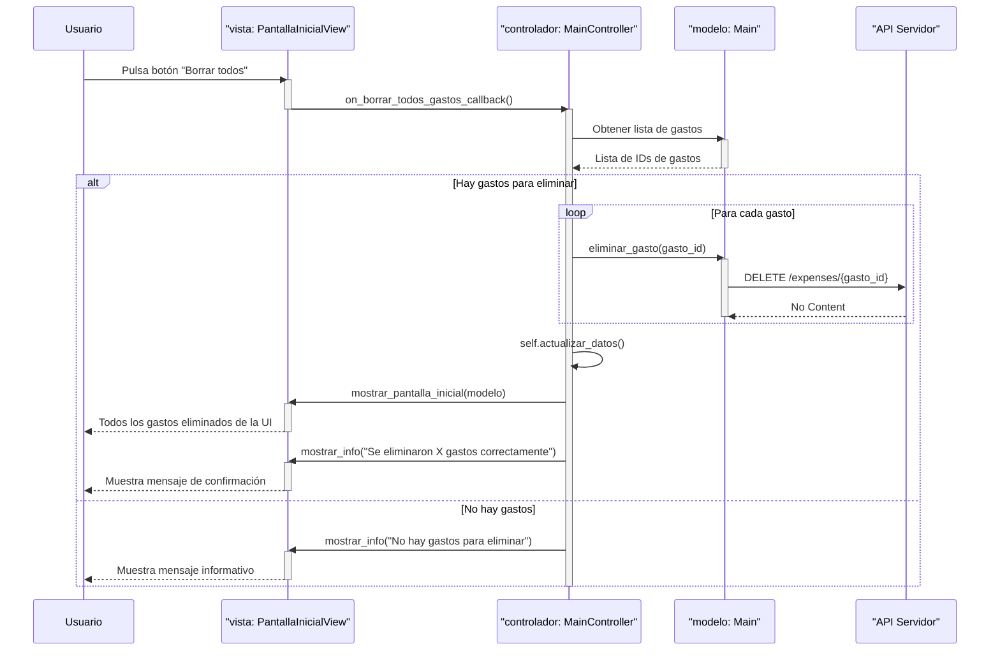
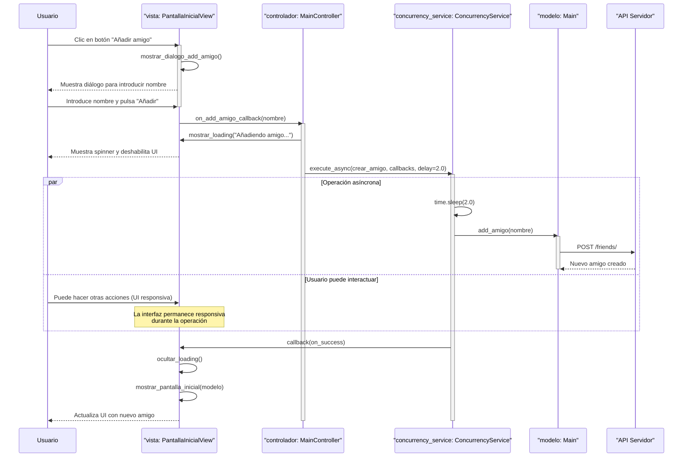
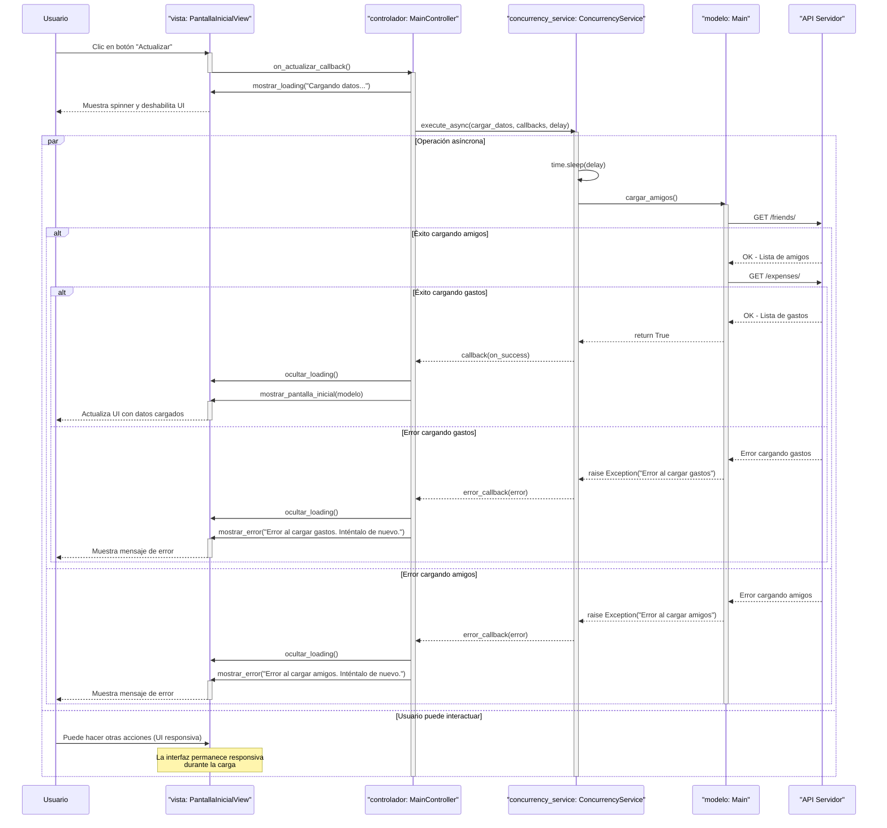

# Diseño del Software

Este documento describe el diseño del sistema, incluyendo los diagramas estático y dinámicos
para una aplicacion que utiliza el patron MVC (Modelo, Vista, Controlador).

---

# Diagrama Estático

# Diagramas Dinámicos

## Secuencia para Añadir un Amigo

## Secuencia para Actualizar un Gasto

## Secuencia para Eliminar un Gasto

## Secuencia para Pagar Saldo

## Secuencia para Añadir un Gasto

## Secuencia para Eliminar un Amigo

## Secuencia para Borrar Todos los Gastos

## Secuencia para Añadir un Amigo con Concurrencia

## Secuencia para Actualizar Datos con Concurrencia

