# Diseño del Software

Este documento describe el diseño del sistema, incluyendo los diagramas estático y dinámico para una aplicación móvil que utiliza el patrón MVVM (Model-View-ViewModel).

---

# Diagrama Estático

A continuación se muestra la transcripción del diagrama usando Mermaid:

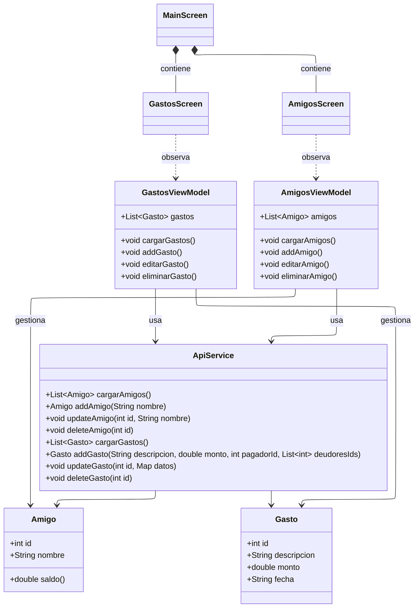
```mermaid
---
config:
  layout: elk
---
classDiagram
direction TB

    class Amigo {
        +int id
        +String nombre
        +double saldo()
    }
    
    class Gasto {
        +int id
        +String descripcion
        +double monto
        +String fecha
    }

    class ApiService {
        +List~Amigo~ cargarAmigos()
        +Amigo addAmigo(String nombre)
        +void updateAmigo(int id, String nombre)
        +void deleteAmigo(int id)

        +List~Gasto~ cargarGastos()
        +Gasto addGasto(String descripcion, double monto, int pagadorId, List~int~ deudoresIds)
        +void updateGasto(int id, Map datos)
        +void deleteGasto(int id)
    }

    class GastosViewModel {
        +List~Gasto~ gastos
        +void cargarGastos()
        +void addGasto()
        +void editarGasto()
        +void eliminarGasto()
    }
    
    class AmigosViewModel {
        +List~Amigo~ amigos
        +void cargarAmigos()
        +void addAmigo()
        +void editarAmigo()
        +void eliminarAmigo()
    }

    class MainScreen
    class GastosScreen
    class AmigosScreen

    ApiService --> Amigo
    ApiService --> Gasto

    GastosViewModel --> ApiService : usa
    GastosViewModel --> Gasto : gestiona

    AmigosViewModel --> ApiService : usa
    AmigosViewModel --> Amigo : gestiona

    MainScreen *-- GastosScreen : contiene
    MainScreen *-- AmigosScreen : contiene

    GastosScreen ..> GastosViewModel : observa
    AmigosScreen ..> AmigosViewModel : observa

```

---

# Diagramas Dinámicos para Móvil

A continuación se muestran los diagramas de secuencia para los casos de uso principales de la aplicación en la versión **móvil**, donde las listas de **Gastos** y **Amigos** se muestran en **pestañas separadas**.

## Secuencia para Añadir un Amigo (Móvil)

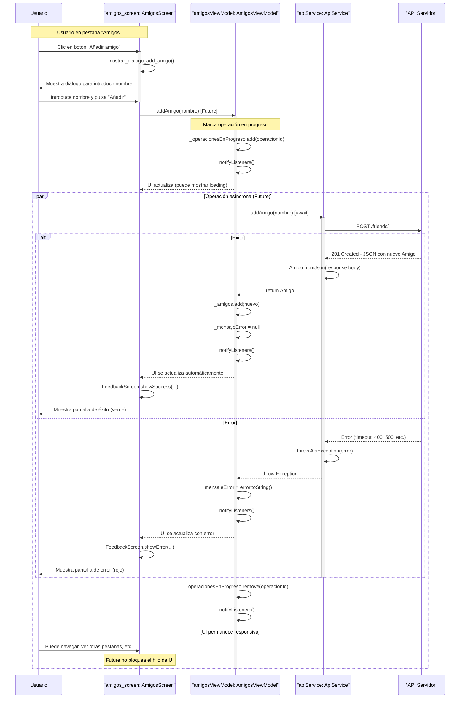
```mermaid
sequenceDiagram
    participant Usuario
    participant AmigosScreen as "amigos_screen: AmigosScreen"
    participant ViewModel as "amigosViewModel: AmigosViewModel"
    participant ApiService as "apiService: ApiService"
    participant API as "API Servidor"

    Note over Usuario,AmigosScreen: Usuario en pestaña "Amigos"

    Usuario->>AmigosScreen: Clic en botón "Añadir amigo"
    activate AmigosScreen
    AmigosScreen->>AmigosScreen: mostrar_dialogo_add_amigo()
    AmigosScreen-->>Usuario: Muestra diálogo para introducir nombre
    Usuario->>AmigosScreen: Introduce nombre y pulsa "Añadir"
    deactivate AmigosScreen

    AmigosScreen->>ViewModel: addAmigo(nombre) [Future]
    activate ViewModel
    
    Note over ViewModel: Marca operación en progreso
    ViewModel->>ViewModel: _operacionesEnProgreso.add(operacionId)
    ViewModel->>ViewModel: notifyListeners()
    ViewModel-->>AmigosScreen: UI actualiza (puede mostrar loading)
    
    par Operación asíncrona (Future)
        ViewModel->>ApiService: addAmigo(nombre) [await]
        activate ApiService
        ApiService->>API: POST /friends/
        
        alt Éxito
            API-->>ApiService: 201 Created - JSON con nuevo Amigo
            ApiService->>ApiService: Amigo.fromJson(response.body)
            ApiService-->>ViewModel: return Amigo
            
            ViewModel->>ViewModel: _amigos.add(nuevo)
            ViewModel->>ViewModel: _mensajeError = null
            ViewModel->>ViewModel: notifyListeners()
            ViewModel-->>AmigosScreen: UI se actualiza automáticamente
            
            AmigosScreen->>AmigosScreen: FeedbackScreen.showSuccess(...)
            AmigosScreen-->>Usuario: Muestra pantalla de éxito (verde)
            
        else Error
            API-->>ApiService: Error (timeout, 400, 500, etc.)
            ApiService->>ApiService: throw ApiException(error)
            ApiService-->>ViewModel: throw Exception
            
            ViewModel->>ViewModel: _mensajeError = error.toString()
            ViewModel->>ViewModel: notifyListeners()
            ViewModel-->>AmigosScreen: UI se actualiza con error
            
            AmigosScreen->>AmigosScreen: FeedbackScreen.showError(...)
            AmigosScreen-->>Usuario: Muestra pantalla de error (rojo)
        end
        
        deactivate ApiService
        ViewModel->>ViewModel: _operacionesEnProgreso.remove(operacionId)
        ViewModel->>ViewModel: notifyListeners()
        
    and UI permanece responsiva
        Usuario->>AmigosScreen: Puede navegar, ver otras pestañas, etc.
        Note over AmigosScreen: Future no bloquea el hilo de UI
    end
    
    deactivate ViewModel
```

## Secuencia para Actualizar un Gasto (Móvil)

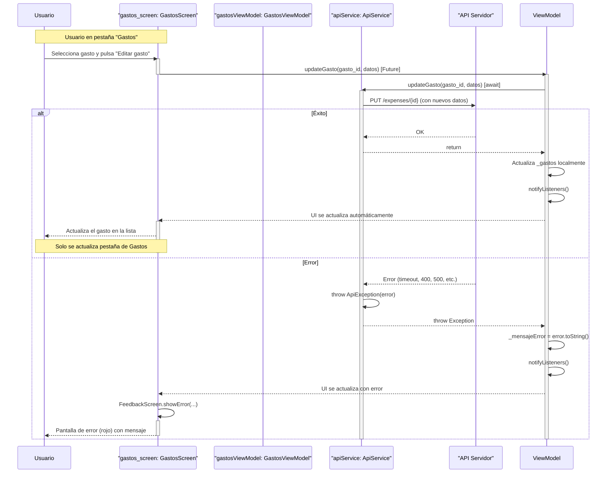
```mermaid
sequenceDiagram
    participant Usuario
    participant GastosScreen as "gastos_screen: GastosScreen"
    participant GastosViewModel as "gastosViewModel: GastosViewModel"
    participant ApiService as "apiService: ApiService"
    participant API as "API Servidor"

    Note over Usuario,GastosScreen: Usuario en pestaña "Gastos"

    Usuario->>GastosScreen: Selecciona gasto y pulsa "Editar gasto"
    activate GastosScreen
    GastosScreen->>ViewModel: updateGasto(gasto_id, datos) [Future]
    deactivate GastosScreen
    activate ViewModel

    ViewModel->>ApiService: updateGasto(gasto_id, datos) [await]
    activate ApiService
    ApiService->>API: PUT /expenses/{id} (con nuevos datos)
    
    alt Éxito
        API-->>ApiService: OK
        ApiService-->>ViewModel: return
        
        ViewModel->>ViewModel: Actualiza _gastos localmente
        ViewModel->>ViewModel: notifyListeners()
        ViewModel-->>GastosScreen: UI se actualiza automáticamente
        activate GastosScreen
        GastosScreen-->>Usuario: Actualiza el gasto en la lista
        Note over Usuario,GastosScreen: Solo se actualiza pestaña de Gastos
        deactivate GastosScreen
    else Error
        API-->>ApiService: Error (timeout, 400, 500, etc.)
        ApiService->>ApiService: throw ApiException(error)
        ApiService-->>ViewModel: throw Exception
        
        ViewModel->>ViewModel: _mensajeError = error.toString()
        ViewModel->>ViewModel: notifyListeners()
        ViewModel-->>GastosScreen: UI se actualiza con error
        GastosScreen->>GastosScreen: FeedbackScreen.showError(...)
        activate GastosScreen
        GastosScreen-->>Usuario: Pantalla de error (rojo) con mensaje
        deactivate GastosScreen
    end
    
    deactivate ApiService
    deactivate ViewModel
```

## Secuencia para Eliminar un Gasto (Móvil)

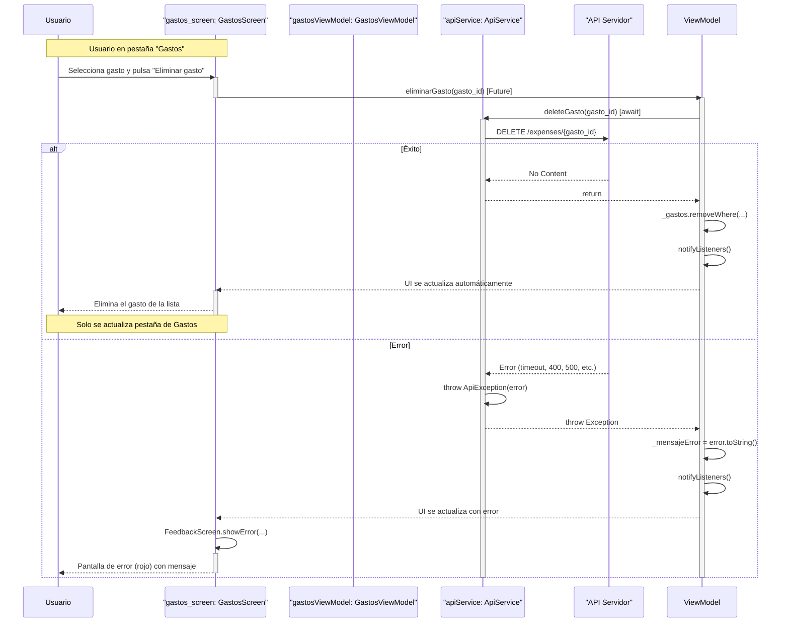
```mermaid
sequenceDiagram
    participant Usuario
    participant GastosScreen as "gastos_screen: GastosScreen"
    participant GastosViewModel as "gastosViewModel: GastosViewModel"
    participant ApiService as "apiService: ApiService"
    participant API as "API Servidor"

    Note over Usuario,GastosScreen: Usuario en pestaña "Gastos"

    Usuario->>GastosScreen: Selecciona gasto y pulsa "Eliminar gasto"
    activate GastosScreen
    GastosScreen->>ViewModel: eliminarGasto(gasto_id) [Future]
    deactivate GastosScreen
    activate ViewModel

    ViewModel->>ApiService: deleteGasto(gasto_id) [await]
    activate ApiService
    ApiService->>API: DELETE /expenses/{gasto_id}
    
    alt Éxito
        API-->>ApiService: No Content
        ApiService-->>ViewModel: return
        
        ViewModel->>ViewModel: _gastos.removeWhere(...)
        ViewModel->>ViewModel: notifyListeners()
        ViewModel-->>GastosScreen: UI se actualiza automáticamente
        activate GastosScreen
        GastosScreen-->>Usuario: Elimina el gasto de la lista
        Note over Usuario,GastosScreen: Solo se actualiza pestaña de Gastos
        deactivate GastosScreen
    else Error
        API-->>ApiService: Error (timeout, 400, 500, etc.)
        ApiService->>ApiService: throw ApiException(error)
        ApiService-->>ViewModel: throw Exception
        
        ViewModel->>ViewModel: _mensajeError = error.toString()
        ViewModel->>ViewModel: notifyListeners()
        ViewModel-->>GastosScreen: UI se actualiza con error
        GastosScreen->>GastosScreen: FeedbackScreen.showError(...)
        activate GastosScreen
        GastosScreen-->>Usuario: Pantalla de error (rojo) con mensaje
        deactivate GastosScreen
    end
    
    deactivate ApiService
    deactivate ViewModel
```

## Secuencia para Pagar Saldo (Móvil)

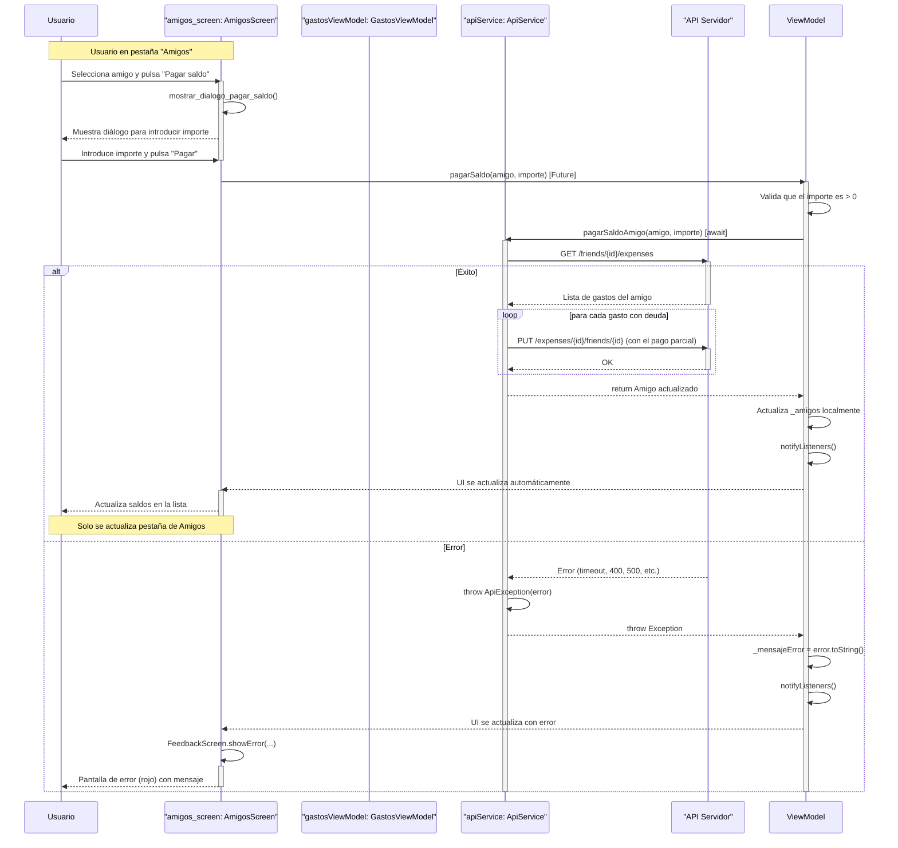
```mermaid
sequenceDiagram
    participant Usuario
    participant AmigosScreen as "amigos_screen: AmigosScreen"
    participant GastosViewModel as "gastosViewModel: GastosViewModel"
    participant ApiService as "apiService: ApiService"
    participant API as "API Servidor"

    Note over Usuario,AmigosScreen: Usuario en pestaña "Amigos"

    Usuario->>AmigosScreen: Selecciona amigo y pulsa "Pagar saldo"
    activate AmigosScreen
    AmigosScreen->>AmigosScreen: mostrar_dialogo_pagar_saldo()
    AmigosScreen-->>Usuario: Muestra diálogo para introducir importe
    Usuario->>AmigosScreen: Introduce importe y pulsa "Pagar"
    deactivate AmigosScreen

    AmigosScreen->>ViewModel: pagarSaldo(amigo, importe) [Future]
    activate ViewModel
    ViewModel->>ViewModel: Valida que el importe es > 0
    ViewModel->>ApiService: pagarSaldoAmigo(amigo, importe) [await]
    activate ApiService

    ApiService->>API: GET /friends/{id}/expenses
    activate API
    
    alt Éxito
        API-->>ApiService: Lista de gastos del amigo
        deactivate API

        loop para cada gasto con deuda
            ApiService->>API: PUT /expenses/{id}/friends/{id} (con el pago parcial)
            activate API
            API-->>ApiService: OK
            deactivate API
        end

        ApiService-->>ViewModel: return Amigo actualizado
        
        ViewModel->>ViewModel: Actualiza _amigos localmente
        ViewModel->>ViewModel: notifyListeners()
        ViewModel-->>AmigosScreen: UI se actualiza automáticamente
        activate AmigosScreen
        AmigosScreen-->>Usuario: Actualiza saldos en la lista
        Note over Usuario,AmigosScreen: Solo se actualiza pestaña de Amigos
        deactivate AmigosScreen
    else Error
        API-->>ApiService: Error (timeout, 400, 500, etc.)
        ApiService->>ApiService: throw ApiException(error)
        ApiService-->>ViewModel: throw Exception
        
        ViewModel->>ViewModel: _mensajeError = error.toString()
        ViewModel->>ViewModel: notifyListeners()
        ViewModel-->>AmigosScreen: UI se actualiza con error
        AmigosScreen->>AmigosScreen: FeedbackScreen.showError(...)
        activate AmigosScreen
        AmigosScreen-->>Usuario: Pantalla de error (rojo) con mensaje
        deactivate AmigosScreen
    end
    
    deactivate ApiService
    deactivate ViewModel
```

## Secuencia para Añadir un Gasto (Móvil)

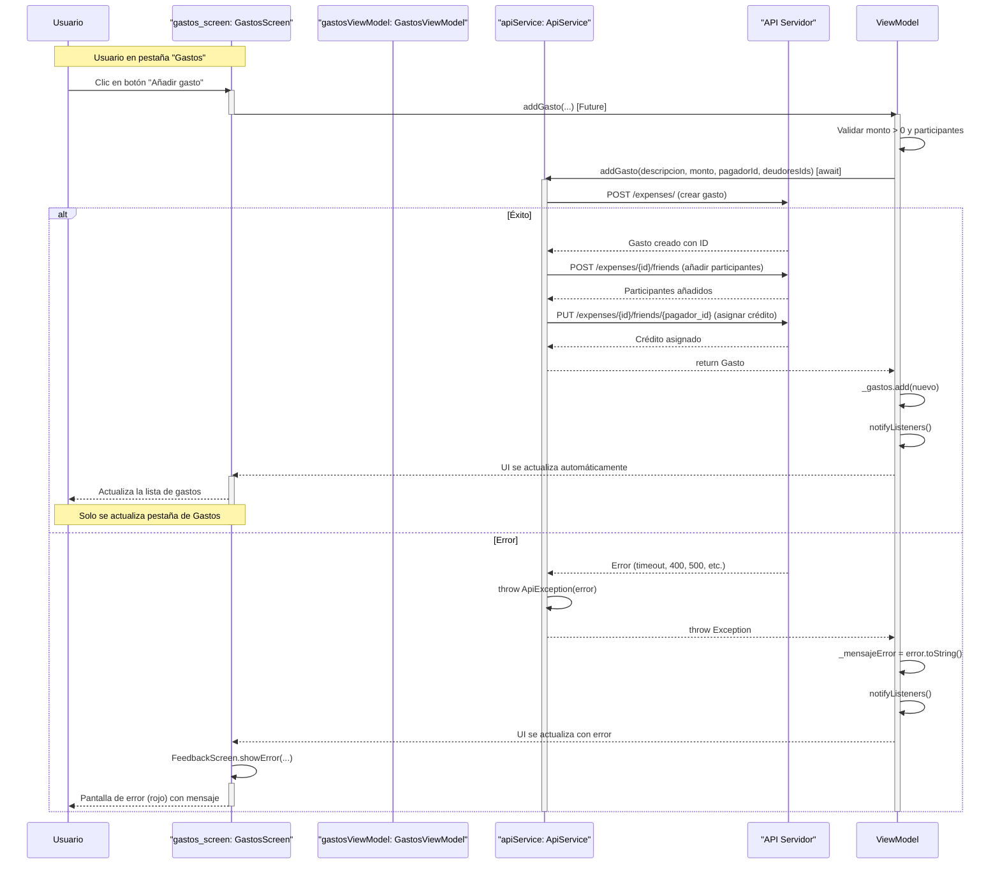
```mermaid
sequenceDiagram
    participant Usuario
    participant GastosScreen as "gastos_screen: GastosScreen"
    participant GastosViewModel as "gastosViewModel: GastosViewModel"
    participant ApiService as "apiService: ApiService"
    participant API as "API Servidor"

    Note over Usuario,GastosScreen: Usuario en pestaña "Gastos"

    Usuario->>GastosScreen: Clic en botón "Añadir gasto"
    activate GastosScreen

    GastosScreen->>ViewModel: addGasto(...) [Future]
    deactivate GastosScreen
    activate ViewModel

    ViewModel->>ViewModel: Validar monto > 0 y participantes
    ViewModel->>ApiService: addGasto(descripcion, monto, pagadorId, deudoresIds) [await]
    activate ApiService

    ApiService->>API: POST /expenses/ (crear gasto)
    
    alt Éxito
        API-->>ApiService: Gasto creado con ID
        ApiService->>API: POST /expenses/{id}/friends (añadir participantes)
        API-->>ApiService: Participantes añadidos
        ApiService->>API: PUT /expenses/{id}/friends/{pagador_id} (asignar crédito)
        API-->>ApiService: Crédito asignado
        ApiService-->>ViewModel: return Gasto
        
        ViewModel->>ViewModel: _gastos.add(nuevo)
        ViewModel->>ViewModel: notifyListeners()
        ViewModel-->>GastosScreen: UI se actualiza automáticamente
        activate GastosScreen
        GastosScreen-->>Usuario: Actualiza la lista de gastos
        Note over Usuario,GastosScreen: Solo se actualiza pestaña de Gastos
        deactivate GastosScreen
    else Error
        API-->>ApiService: Error (timeout, 400, 500, etc.)
        ApiService->>ApiService: throw ApiException(error)
        ApiService-->>ViewModel: throw Exception
        
        ViewModel->>ViewModel: _mensajeError = error.toString()
        ViewModel->>ViewModel: notifyListeners()
        ViewModel-->>GastosScreen: UI se actualiza con error
        GastosScreen->>GastosScreen: FeedbackScreen.showError(...)
        activate GastosScreen
        GastosScreen-->>Usuario: Pantalla de error (rojo) con mensaje
        deactivate GastosScreen
    end

    deactivate ApiService
    deactivate ViewModel
```

## Secuencia para Eliminar un Amigo (Móvil)

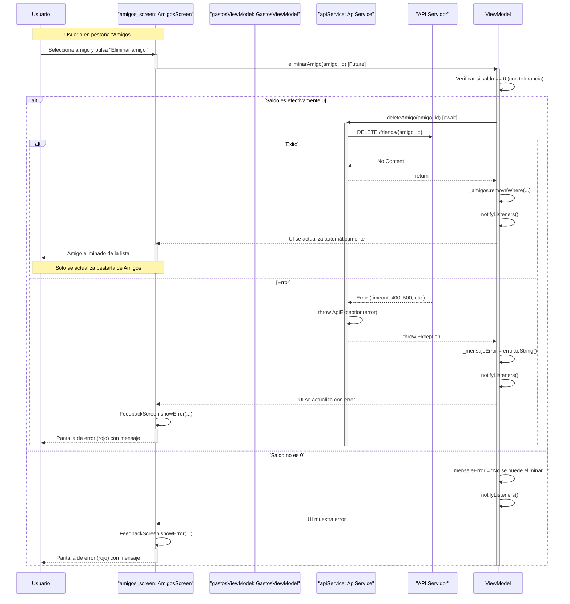
```mermaid
sequenceDiagram
    participant Usuario
    participant AmigosScreen as "amigos_screen: AmigosScreen"
    participant GastosViewModel as "gastosViewModel: GastosViewModel"
    participant ApiService as "apiService: ApiService"
    participant API as "API Servidor"

    Note over Usuario,AmigosScreen: Usuario en pestaña "Amigos"

    Usuario->>AmigosScreen: Selecciona amigo y pulsa "Eliminar amigo"
    activate AmigosScreen
    AmigosScreen->>ViewModel: eliminarAmigo(amigo_id) [Future]
    deactivate AmigosScreen
    activate ViewModel

    ViewModel->>ViewModel: Verificar si saldo == 0 (con tolerancia)

    alt Saldo es efectivamente 0
        ViewModel->>ApiService: deleteAmigo(amigo_id) [await]
        activate ApiService
        ApiService->>API: DELETE /friends/{amigo_id}
        
        alt Éxito
            API-->>ApiService: No Content
            ApiService-->>ViewModel: return
            
            ViewModel->>ViewModel: _amigos.removeWhere(...)
            ViewModel->>ViewModel: notifyListeners()
            ViewModel-->>AmigosScreen: UI se actualiza automáticamente
            activate AmigosScreen
            AmigosScreen-->>Usuario: Amigo eliminado de la lista
            Note over Usuario,AmigosScreen: Solo se actualiza pestaña de Amigos
            deactivate AmigosScreen
        else Error
            API-->>ApiService: Error (timeout, 400, 500, etc.)
            ApiService->>ApiService: throw ApiException(error)
            ApiService-->>ViewModel: throw Exception
            
            ViewModel->>ViewModel: _mensajeError = error.toString()
            ViewModel->>ViewModel: notifyListeners()
            ViewModel-->>AmigosScreen: UI se actualiza con error
            AmigosScreen->>AmigosScreen: FeedbackScreen.showError(...)
            activate AmigosScreen
            AmigosScreen-->>Usuario: Pantalla de error (rojo) con mensaje
            deactivate AmigosScreen
        end
        deactivate ApiService
    else Saldo no es 0
        ViewModel->>ViewModel: _mensajeError = "No se puede eliminar..."
        ViewModel->>ViewModel: notifyListeners()
        ViewModel-->>AmigosScreen: UI muestra error
        AmigosScreen->>AmigosScreen: FeedbackScreen.showError(...)
        activate AmigosScreen
        AmigosScreen-->>Usuario: Pantalla de error (rojo) con mensaje
        deactivate AmigosScreen
    end

    deactivate ViewModel
```

## Secuencia para Borrar Todos los Gastos (Móvil)

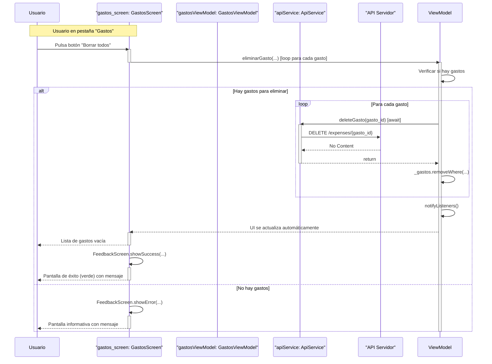
```mermaid
sequenceDiagram
    participant Usuario
    participant GastosScreen as "gastos_screen: GastosScreen"
    participant GastosViewModel as "gastosViewModel: GastosViewModel"
    participant ApiService as "apiService: ApiService"
    participant API as "API Servidor"

    Note over Usuario,GastosScreen: Usuario en pestaña "Gastos"

    Usuario->>GastosScreen: Pulsa botón "Borrar todos"
    activate GastosScreen
    GastosScreen->>ViewModel: eliminarGasto(...) [loop para cada gasto]
    deactivate GastosScreen
    activate ViewModel

    ViewModel->>ViewModel: Verificar si hay gastos

    alt Hay gastos para eliminar
        loop Para cada gasto
            ViewModel->>ApiService: deleteGasto(gasto_id) [await]
            activate ApiService
            ApiService->>API: DELETE /expenses/{gasto_id}
            API-->>ApiService: No Content
            ApiService-->>ViewModel: return
            deactivate ApiService
            
            ViewModel->>ViewModel: _gastos.removeWhere(...)
        end
        
        ViewModel->>ViewModel: notifyListeners()
        ViewModel-->>GastosScreen: UI se actualiza automáticamente
        activate GastosScreen
        GastosScreen-->>Usuario: Lista de gastos vacía
        deactivate GastosScreen
        
        GastosScreen->>GastosScreen: FeedbackScreen.showSuccess(...)
        activate GastosScreen
        GastosScreen-->>Usuario: Pantalla de éxito (verde) con mensaje
        deactivate GastosScreen
    else No hay gastos
        GastosScreen->>GastosScreen: FeedbackScreen.showError(...)
        activate GastosScreen
        GastosScreen-->>Usuario: Pantalla informativa con mensaje
        deactivate GastosScreen
    end

    deactivate ViewModel
```

## Secuencia para Añadir un Amigo con Concurrencia (Móvil)

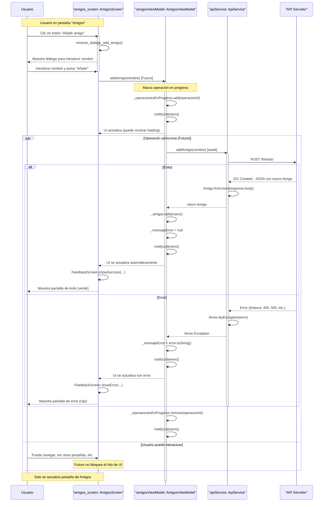
```mermaid
sequenceDiagram
    participant Usuario
    participant AmigosScreen as "amigos_screen: AmigosScreen"
    participant ViewModel as "amigosViewModel: AmigosViewModel"
    participant ApiService as "apiService: ApiService"
    participant API as "API Servidor"

    Note over Usuario,AmigosScreen: Usuario en pestaña "Amigos"

    Usuario->>AmigosScreen: Clic en botón "Añadir amigo"
    activate AmigosScreen
    AmigosScreen->>AmigosScreen: mostrar_dialogo_add_amigo()
    AmigosScreen-->>Usuario: Muestra diálogo para introducir nombre
    Usuario->>AmigosScreen: Introduce nombre y pulsa "Añadir"
    deactivate AmigosScreen

    AmigosScreen->>ViewModel: addAmigo(nombre) [Future]
    activate ViewModel
    
    Note over ViewModel: Marca operación en progreso
    ViewModel->>ViewModel: _operacionesEnProgreso.add(operacionId)
    ViewModel->>ViewModel: notifyListeners()
    ViewModel-->>AmigosScreen: UI actualiza (puede mostrar loading)
    
    par Operación asíncrona (Future)
        ViewModel->>ApiService: addAmigo(nombre) [await]
        activate ApiService
        ApiService->>API: POST /friends/
        
        alt Éxito
            API-->>ApiService: 201 Created - JSON con nuevo Amigo
            ApiService->>ApiService: Amigo.fromJson(response.body)
            ApiService-->>ViewModel: return Amigo
            
            ViewModel->>ViewModel: _amigos.add(nuevo)
            ViewModel->>ViewModel: _mensajeError = null
            ViewModel->>ViewModel: notifyListeners()
            ViewModel-->>AmigosScreen: UI se actualiza automáticamente
            
            AmigosScreen->>AmigosScreen: FeedbackScreen.showSuccess(...)
            AmigosScreen-->>Usuario: Muestra pantalla de éxito (verde)
            
        else Error
            API-->>ApiService: Error (timeout, 400, 500, etc.)
            ApiService->>ApiService: throw ApiException(error)
            ApiService-->>ViewModel: throw Exception
            
            ViewModel->>ViewModel: _mensajeError = error.toString()
            ViewModel->>ViewModel: notifyListeners()
            ViewModel-->>AmigosScreen: UI se actualiza con error
            
            AmigosScreen->>AmigosScreen: FeedbackScreen.showError(...)
            AmigosScreen-->>Usuario: Muestra pantalla de error (rojo)
        end
        
        deactivate ApiService
        ViewModel->>ViewModel: _operacionesEnProgreso.remove(operacionId)
        ViewModel->>ViewModel: notifyListeners()
        
    and Usuario puede interactuar
        Usuario->>AmigosScreen: Puede navegar, ver otras pestañas, etc.
        Note over AmigosScreen: Future no bloquea el hilo de UI
    end
    
    Note over Usuario,AmigosScreen: Solo se actualiza pestaña de Amigos
    deactivate ViewModel
```

## Secuencia para Actualizar Datos con Concurrencia (Móvil)

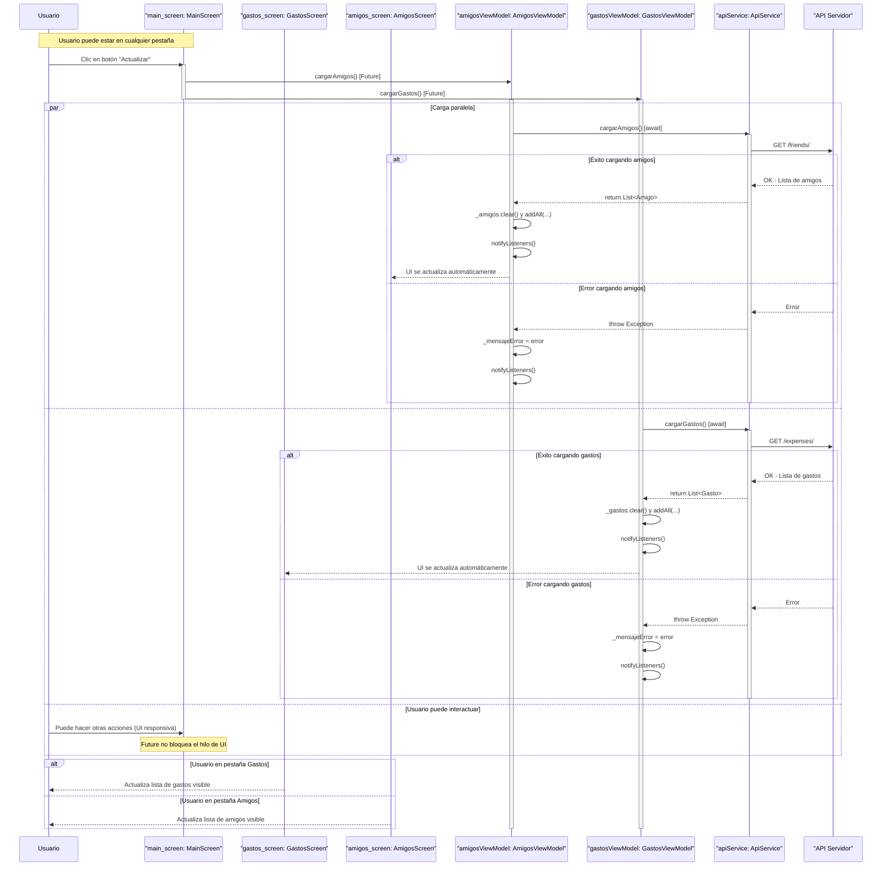
```mermaid
sequenceDiagram
    participant Usuario
    participant MainScreen as "main_screen: MainScreen"
    participant GastosScreen as "gastos_screen: GastosScreen"
    participant AmigosScreen as "amigos_screen: AmigosScreen"
    participant AmigosViewModel as "amigosViewModel: AmigosViewModel"
    participant GastosViewModel as "gastosViewModel: GastosViewModel"
    participant ApiService as "apiService: ApiService"
    participant API as "API Servidor"

    Note over Usuario,MainScreen: Usuario puede estar en cualquier pestaña

    Usuario->>MainScreen: Clic en botón "Actualizar"
    activate MainScreen
    MainScreen->>AmigosViewModel: cargarAmigos() [Future]
    MainScreen->>GastosViewModel: cargarGastos() [Future]
    deactivate MainScreen
    activate AmigosViewModel
    activate GastosViewModel
    
    par Carga paralela
        AmigosViewModel->>ApiService: cargarAmigos() [await]
        activate ApiService
        ApiService->>API: GET /friends/
        alt Éxito cargando amigos
            API-->>ApiService: OK - Lista de amigos
            ApiService-->>AmigosViewModel: return List<Amigo>
            AmigosViewModel->>AmigosViewModel: _amigos.clear() y addAll(...)
            AmigosViewModel->>AmigosViewModel: notifyListeners()
            AmigosViewModel-->>AmigosScreen: UI se actualiza automáticamente
        else Error cargando amigos
            API-->>ApiService: Error
            ApiService-->>AmigosViewModel: throw Exception
            AmigosViewModel->>AmigosViewModel: _mensajeError = error
            AmigosViewModel->>AmigosViewModel: notifyListeners()
        end
        deactivate ApiService
    and
        GastosViewModel->>ApiService: cargarGastos() [await]
        activate ApiService
        ApiService->>API: GET /expenses/
        alt Éxito cargando gastos
            API-->>ApiService: OK - Lista de gastos
            ApiService-->>GastosViewModel: return List<Gasto>
            GastosViewModel->>GastosViewModel: _gastos.clear() y addAll(...)
            GastosViewModel->>GastosViewModel: notifyListeners()
            GastosViewModel-->>GastosScreen: UI se actualiza automáticamente
        else Error cargando gastos
            API-->>ApiService: Error
            ApiService-->>GastosViewModel: throw Exception
            GastosViewModel->>GastosViewModel: _mensajeError = error
            GastosViewModel->>GastosViewModel: notifyListeners()
        end
        deactivate ApiService
    and Usuario puede interactuar
        Usuario->>MainScreen: Puede hacer otras acciones (UI responsiva)
        Note over MainScreen: Future no bloquea el hilo de UI
    end
    
    alt Usuario en pestaña Gastos
        GastosScreen-->>Usuario: Actualiza lista de gastos visible
    else Usuario en pestaña Amigos
        AmigosScreen-->>Usuario: Actualiza lista de amigos visible
    end
    
    deactivate AmigosViewModel
    deactivate GastosViewModel

```

---

# Diagramas Dinámicos para Tablet

Los siguientes diagramas muestran las secuencias para la versión tablet de la aplicación, donde las listas de **Gastos** y **Amigos** se muestran simultáneamente en la misma pantalla mediante una vista dividida.

## Secuencia para Añadir un Amigo (Tablet)

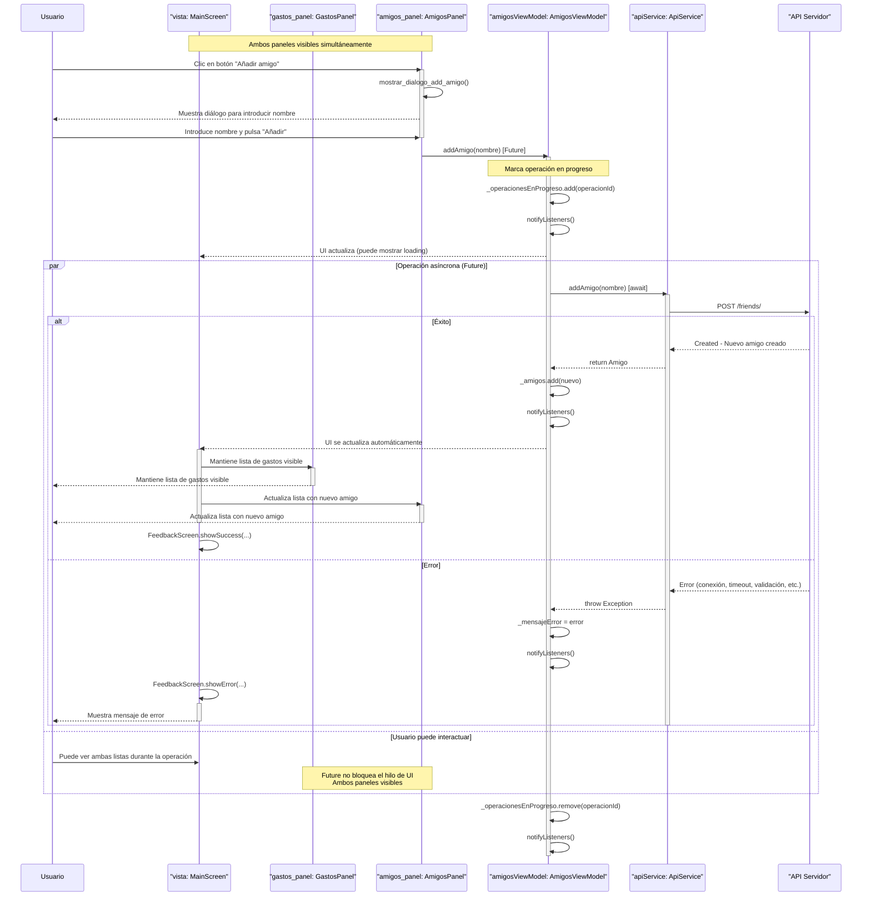
```mermaid
sequenceDiagram
    participant Usuario
    participant Vista as "vista: MainScreen"
    participant GastosPanel as "gastos_panel: GastosPanel"
    participant AmigosPanel as "amigos_panel: AmigosPanel"
    participant AmigosViewModel as "amigosViewModel: AmigosViewModel"
    participant ApiService as "apiService: ApiService"
    participant API as "API Servidor"

    Note over Vista,AmigosPanel: Ambos paneles visibles simultáneamente

    Usuario->>AmigosPanel: Clic en botón "Añadir amigo"
    activate AmigosPanel
    AmigosPanel->>AmigosPanel: mostrar_dialogo_add_amigo()
    AmigosPanel-->>Usuario: Muestra diálogo para introducir nombre
    Usuario->>AmigosPanel: Introduce nombre y pulsa "Añadir"
    deactivate AmigosPanel

    AmigosPanel->>AmigosViewModel: addAmigo(nombre) [Future]
    activate AmigosViewModel
    
    Note over AmigosViewModel: Marca operación en progreso
    AmigosViewModel->>AmigosViewModel: _operacionesEnProgreso.add(operacionId)
    AmigosViewModel->>AmigosViewModel: notifyListeners()
    AmigosViewModel-->>Vista: UI actualiza (puede mostrar loading)
    
    par Operación asíncrona (Future)
        AmigosViewModel->>ApiService: addAmigo(nombre) [await]
        activate ApiService
        ApiService->>API: POST /friends/
        alt Éxito
            API-->>ApiService: Created - Nuevo amigo creado
            ApiService-->>AmigosViewModel: return Amigo
            AmigosViewModel->>AmigosViewModel: _amigos.add(nuevo)
            AmigosViewModel->>AmigosViewModel: notifyListeners()
            AmigosViewModel-->>Vista: UI se actualiza automáticamente
            activate Vista
            Vista->>GastosPanel: Mantiene lista de gastos visible
            activate GastosPanel
            GastosPanel-->>Usuario: Mantiene lista de gastos visible
            deactivate GastosPanel
            Vista->>AmigosPanel: Actualiza lista con nuevo amigo
            activate AmigosPanel
            AmigosPanel-->>Usuario: Actualiza lista con nuevo amigo
            deactivate AmigosPanel
            deactivate Vista
            Vista->>Vista: FeedbackScreen.showSuccess(...)
        else Error
            API-->>ApiService: Error (conexión, timeout, validación, etc.)
            ApiService-->>AmigosViewModel: throw Exception
            AmigosViewModel->>AmigosViewModel: _mensajeError = error
            AmigosViewModel->>AmigosViewModel: notifyListeners()
            Vista->>Vista: FeedbackScreen.showError(...)
            activate Vista
            Vista-->>Usuario: Muestra mensaje de error
            deactivate Vista
        end
        deactivate ApiService
    and Usuario puede interactuar
        Usuario->>Vista: Puede ver ambas listas durante la operación
        Note over GastosPanel,AmigosPanel: Future no bloquea el hilo de UI<br/>Ambos paneles visibles
    end
    
    AmigosViewModel->>AmigosViewModel: _operacionesEnProgreso.remove(operacionId)
    AmigosViewModel->>AmigosViewModel: notifyListeners()
    deactivate AmigosViewModel
```

## Secuencia para Añadir un Gasto (Tablet)

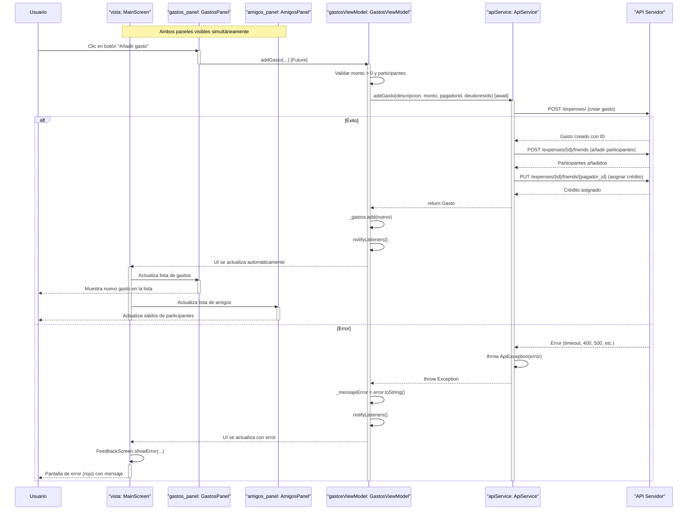
```mermaid
sequenceDiagram
    participant Usuario
    participant Vista as "vista: MainScreen"
    participant GastosPanel as "gastos_panel: GastosPanel"
    participant AmigosPanel as "amigos_panel: AmigosPanel"
    participant GastosViewModel as "gastosViewModel: GastosViewModel"
    participant ApiService as "apiService: ApiService"
    participant API as "API Servidor"

    Note over Vista,AmigosPanel: Ambos paneles visibles simultáneamente

    Usuario->>GastosPanel: Clic en botón "Añadir gasto"
    activate GastosPanel

    GastosPanel->>GastosViewModel: addGasto(...) [Future]
    deactivate GastosPanel
    activate GastosViewModel

    GastosViewModel->>GastosViewModel: Validar monto > 0 y participantes
    GastosViewModel->>ApiService: addGasto(descripcion, monto, pagadorId, deudoresIds) [await]
    activate ApiService

    ApiService->>API: POST /expenses/ (crear gasto)
    
        alt Éxito
            API-->>ApiService: Gasto creado con ID
            ApiService->>API: POST /expenses/{id}/friends (añadir participantes)
            API-->>ApiService: Participantes añadidos
            ApiService->>API: PUT /expenses/{id}/friends/{pagador_id} (asignar crédito)
            API-->>ApiService: Crédito asignado
            ApiService-->>GastosViewModel: return Gasto
            
            GastosViewModel->>GastosViewModel: _gastos.add(nuevo)
            GastosViewModel->>GastosViewModel: notifyListeners()
            GastosViewModel-->>Vista: UI se actualiza automáticamente
            activate Vista
            
            Vista->>GastosPanel: Actualiza lista de gastos
            activate GastosPanel
            GastosPanel-->>Usuario: Muestra nuevo gasto en la lista
            deactivate GastosPanel
            
            Vista->>AmigosPanel: Actualiza lista de amigos
            activate AmigosPanel
            AmigosPanel-->>Usuario: Actualiza saldos de participantes
            deactivate AmigosPanel
            
            deactivate Vista
        else Error
            API-->>ApiService: Error (timeout, 400, 500, etc.)
            ApiService->>ApiService: throw ApiException(error)
            ApiService-->>GastosViewModel: throw Exception
            
            GastosViewModel->>GastosViewModel: _mensajeError = error.toString()
            GastosViewModel->>GastosViewModel: notifyListeners()
            GastosViewModel-->>Vista: UI se actualiza con error
            Vista->>Vista: FeedbackScreen.showError(...)
            activate Vista
            Vista-->>Usuario: Pantalla de error (rojo) con mensaje
            deactivate Vista
        end
        deactivate ApiService

    deactivate GastosViewModel
```

## Secuencia para Actualizar un Gasto (Tablet)

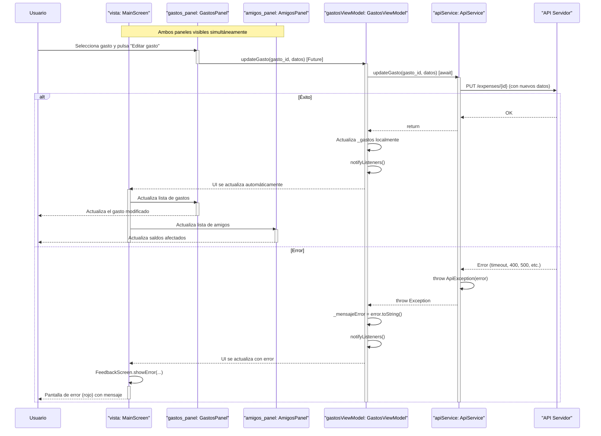
```mermaid
sequenceDiagram
    participant Usuario
    participant Vista as "vista: MainScreen"
    participant GastosPanel as "gastos_panel: GastosPanel"
    participant AmigosPanel as "amigos_panel: AmigosPanel"
    participant GastosViewModel as "gastosViewModel: GastosViewModel"
    participant ApiService as "apiService: ApiService"
    participant API as "API Servidor"

    Note over Vista,AmigosPanel: Ambos paneles visibles simultáneamente

    Usuario->>GastosPanel: Selecciona gasto y pulsa "Editar gasto"
    activate GastosPanel
    GastosPanel->>GastosViewModel: updateGasto(gasto_id, datos) [Future]
    deactivate GastosPanel
    activate GastosViewModel

    GastosViewModel->>ApiService: updateGasto(gasto_id, datos) [await]
    activate ApiService
    ApiService->>API: PUT /expenses/{id} (con nuevos datos)
    
    alt Éxito
        API-->>ApiService: OK
        ApiService-->>GastosViewModel: return
        
        GastosViewModel->>GastosViewModel: Actualiza _gastos localmente
        GastosViewModel->>GastosViewModel: notifyListeners()
        GastosViewModel-->>Vista: UI se actualiza automáticamente
        activate Vista
        
        Vista->>GastosPanel: Actualiza lista de gastos
        activate GastosPanel
        GastosPanel-->>Usuario: Actualiza el gasto modificado
        deactivate GastosPanel
        
        Vista->>AmigosPanel: Actualiza lista de amigos
        activate AmigosPanel
        AmigosPanel-->>Usuario: Actualiza saldos afectados
        deactivate AmigosPanel
        
        deactivate Vista
    else Error
        API-->>ApiService: Error (timeout, 400, 500, etc.)
        ApiService->>ApiService: throw ApiException(error)
        ApiService-->>GastosViewModel: throw Exception
        
        GastosViewModel->>GastosViewModel: _mensajeError = error.toString()
        GastosViewModel->>GastosViewModel: notifyListeners()
        GastosViewModel-->>Vista: UI se actualiza con error
        Vista->>Vista: FeedbackScreen.showError(...)
        activate Vista
        Vista-->>Usuario: Pantalla de error (rojo) con mensaje
        deactivate Vista
    end
    
    deactivate ApiService
    deactivate GastosViewModel
```

## Secuencia para Eliminar un Gasto (Tablet)

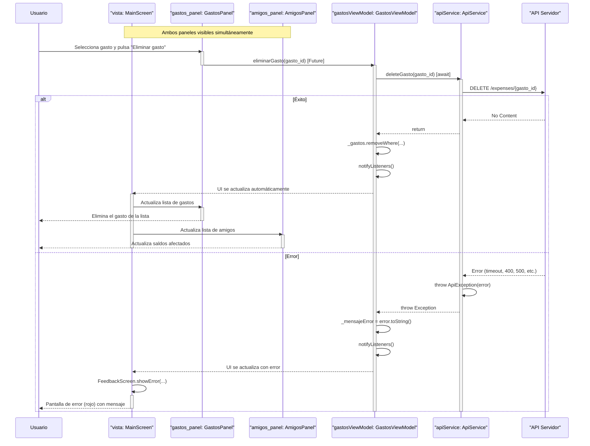
```mermaid
sequenceDiagram
    participant Usuario
    participant Vista as "vista: MainScreen"
    participant GastosPanel as "gastos_panel: GastosPanel"
    participant AmigosPanel as "amigos_panel: AmigosPanel"
    participant GastosViewModel as "gastosViewModel: GastosViewModel"
    participant ApiService as "apiService: ApiService"
    participant API as "API Servidor"

    Note over Vista,AmigosPanel: Ambos paneles visibles simultáneamente

    Usuario->>GastosPanel: Selecciona gasto y pulsa "Eliminar gasto"
    activate GastosPanel
    GastosPanel->>GastosViewModel: eliminarGasto(gasto_id) [Future]
    deactivate GastosPanel
    activate GastosViewModel

    GastosViewModel->>ApiService: deleteGasto(gasto_id) [await]
    activate ApiService
    ApiService->>API: DELETE /expenses/{gasto_id}
    
    alt Éxito
        API-->>ApiService: No Content
        ApiService-->>GastosViewModel: return
        
        GastosViewModel->>GastosViewModel: _gastos.removeWhere(...)
        GastosViewModel->>GastosViewModel: notifyListeners()
        GastosViewModel-->>Vista: UI se actualiza automáticamente
        activate Vista
        
        Vista->>GastosPanel: Actualiza lista de gastos
        activate GastosPanel
        GastosPanel-->>Usuario: Elimina el gasto de la lista
        deactivate GastosPanel
        
        Vista->>AmigosPanel: Actualiza lista de amigos
        activate AmigosPanel
        AmigosPanel-->>Usuario: Actualiza saldos afectados
        deactivate AmigosPanel
        
        deactivate Vista
    else Error
        API-->>ApiService: Error (timeout, 400, 500, etc.)
        ApiService->>ApiService: throw ApiException(error)
        ApiService-->>GastosViewModel: throw Exception
        
        GastosViewModel->>GastosViewModel: _mensajeError = error.toString()
        GastosViewModel->>GastosViewModel: notifyListeners()
        GastosViewModel-->>Vista: UI se actualiza con error
        Vista->>Vista: FeedbackScreen.showError(...)
        activate Vista
        Vista-->>Usuario: Pantalla de error (rojo) con mensaje
        deactivate Vista
    end
    
    deactivate ApiService
    deactivate GastosViewModel
```

## Secuencia para Eliminar un Amigo (Tablet)

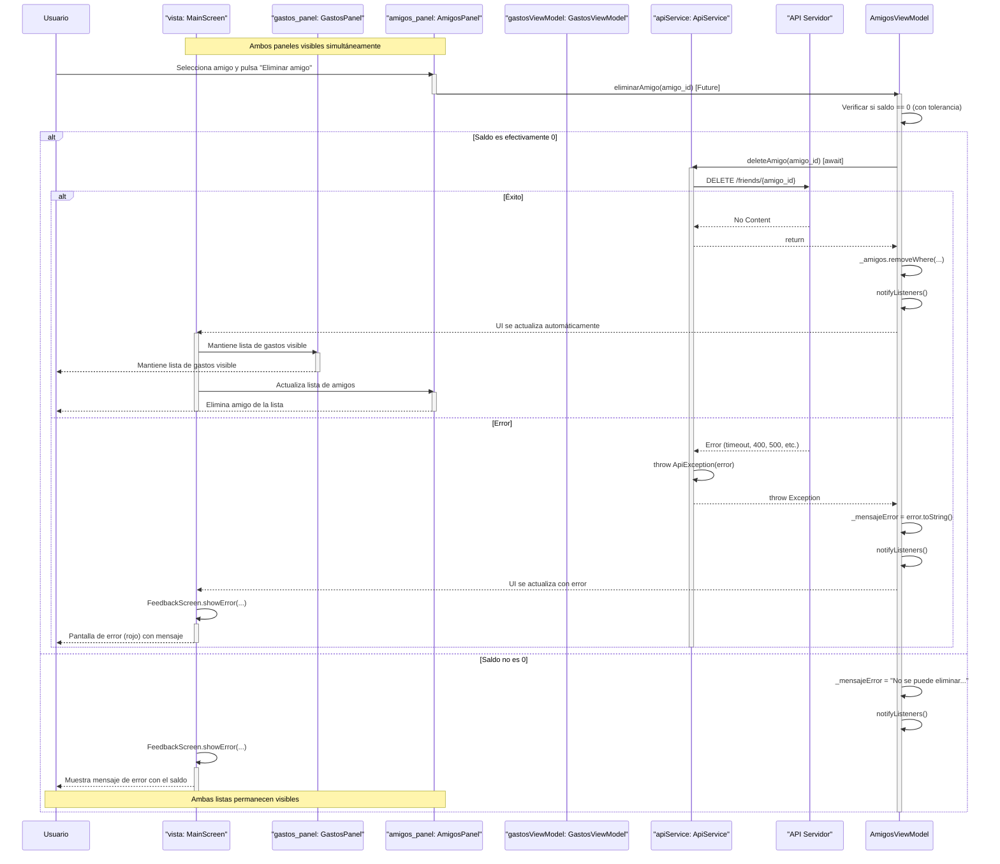
```mermaid
sequenceDiagram
    participant Usuario
    participant Vista as "vista: MainScreen"
    participant GastosPanel as "gastos_panel: GastosPanel"
    participant AmigosPanel as "amigos_panel: AmigosPanel"
    participant GastosViewModel as "gastosViewModel: GastosViewModel"
    participant ApiService as "apiService: ApiService"
    participant API as "API Servidor"

    Note over Vista,AmigosPanel: Ambos paneles visibles simultáneamente

    Usuario->>AmigosPanel: Selecciona amigo y pulsa "Eliminar amigo"
    activate AmigosPanel
    AmigosPanel->>AmigosViewModel: eliminarAmigo(amigo_id) [Future]
    deactivate AmigosPanel
    activate AmigosViewModel

    AmigosViewModel->>AmigosViewModel: Verificar si saldo == 0 (con tolerancia)

    alt Saldo es efectivamente 0
        AmigosViewModel->>ApiService: deleteAmigo(amigo_id) [await]
        activate ApiService
        ApiService->>API: DELETE /friends/{amigo_id}
        
        alt Éxito
            API-->>ApiService: No Content
            ApiService-->>AmigosViewModel: return
            
            AmigosViewModel->>AmigosViewModel: _amigos.removeWhere(...)
            AmigosViewModel->>AmigosViewModel: notifyListeners()
            AmigosViewModel-->>Vista: UI se actualiza automáticamente
            activate Vista
            
            Vista->>GastosPanel: Mantiene lista de gastos visible
            activate GastosPanel
            GastosPanel-->>Usuario: Mantiene lista de gastos visible
            deactivate GastosPanel
            
            Vista->>AmigosPanel: Actualiza lista de amigos
            activate AmigosPanel
            AmigosPanel-->>Usuario: Elimina amigo de la lista
            deactivate AmigosPanel
            
            deactivate Vista
        else Error
            API-->>ApiService: Error (timeout, 400, 500, etc.)
            ApiService->>ApiService: throw ApiException(error)
            ApiService-->>AmigosViewModel: throw Exception
            
            AmigosViewModel->>AmigosViewModel: _mensajeError = error.toString()
            AmigosViewModel->>AmigosViewModel: notifyListeners()
            AmigosViewModel-->>Vista: UI se actualiza con error
            Vista->>Vista: FeedbackScreen.showError(...)
            activate Vista
            Vista-->>Usuario: Pantalla de error (rojo) con mensaje
            deactivate Vista
        end
        deactivate ApiService
    else Saldo no es 0
        AmigosViewModel->>AmigosViewModel: _mensajeError = "No se puede eliminar..."
        AmigosViewModel->>AmigosViewModel: notifyListeners()
        Vista->>Vista: FeedbackScreen.showError(...)
        activate Vista
        Vista-->>Usuario: Muestra mensaje de error con el saldo
        Note over Usuario,AmigosPanel: Ambas listas permanecen visibles
        deactivate Vista
    end

    deactivate AmigosViewModel
```

## Secuencia para Pagar Saldo (Tablet)

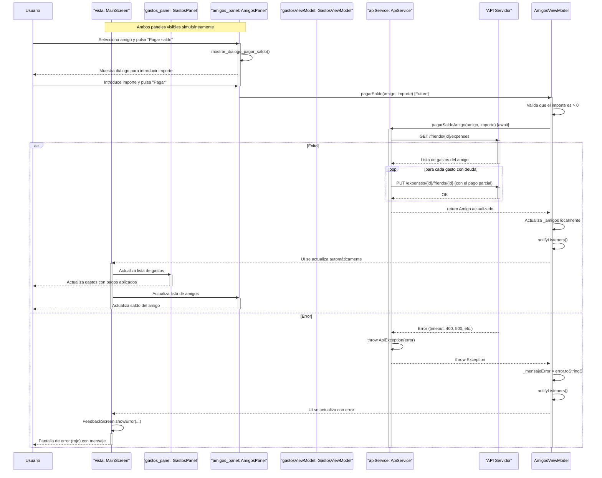
```mermaid
sequenceDiagram
    participant Usuario
    participant Vista as "vista: MainScreen"
    participant GastosPanel as "gastos_panel: GastosPanel"
    participant AmigosPanel as "amigos_panel: AmigosPanel"
    participant GastosViewModel as "gastosViewModel: GastosViewModel"
    participant ApiService as "apiService: ApiService"
    participant API as "API Servidor"

    Note over Vista,AmigosPanel: Ambos paneles visibles simultáneamente

    Usuario->>AmigosPanel: Selecciona amigo y pulsa "Pagar saldo"
    activate AmigosPanel
    AmigosPanel->>AmigosPanel: mostrar_dialogo_pagar_saldo()
    AmigosPanel-->>Usuario: Muestra diálogo para introducir importe
    Usuario->>AmigosPanel: Introduce importe y pulsa "Pagar"
    deactivate AmigosPanel

    AmigosPanel->>AmigosViewModel: pagarSaldo(amigo, importe) [Future]
    activate AmigosViewModel
    AmigosViewModel->>AmigosViewModel: Valida que el importe es > 0
    AmigosViewModel->>ApiService: pagarSaldoAmigo(amigo, importe) [await]
    activate ApiService

    ApiService->>API: GET /friends/{id}/expenses
    activate API
    
    alt Éxito
        API-->>ApiService: Lista de gastos del amigo
        deactivate API

        loop para cada gasto con deuda
            ApiService->>API: PUT /expenses/{id}/friends/{id} (con el pago parcial)
            activate API
            API-->>ApiService: OK
            deactivate API
        end

        ApiService-->>AmigosViewModel: return Amigo actualizado
        
        AmigosViewModel->>AmigosViewModel: Actualiza _amigos localmente
        AmigosViewModel->>AmigosViewModel: notifyListeners()
        AmigosViewModel-->>Vista: UI se actualiza automáticamente
        activate Vista
        
        Vista->>GastosPanel: Actualiza lista de gastos
        activate GastosPanel
        GastosPanel-->>Usuario: Actualiza gastos con pagos aplicados
        deactivate GastosPanel
        
        Vista->>AmigosPanel: Actualiza lista de amigos
        activate AmigosPanel
        AmigosPanel-->>Usuario: Actualiza saldo del amigo
        deactivate AmigosPanel
        
        deactivate Vista
    else Error
        API-->>ApiService: Error (timeout, 400, 500, etc.)
        ApiService->>ApiService: throw ApiException(error)
        ApiService-->>AmigosViewModel: throw Exception
        
        AmigosViewModel->>AmigosViewModel: _mensajeError = error.toString()
        AmigosViewModel->>AmigosViewModel: notifyListeners()
        AmigosViewModel-->>Vista: UI se actualiza con error
        Vista->>Vista: FeedbackScreen.showError(...)
        activate Vista
        Vista-->>Usuario: Pantalla de error (rojo) con mensaje
        deactivate Vista
    end
    
    deactivate ApiService
    deactivate AmigosViewModel
```

## Secuencia para Borrar Todos los Gastos (Tablet)

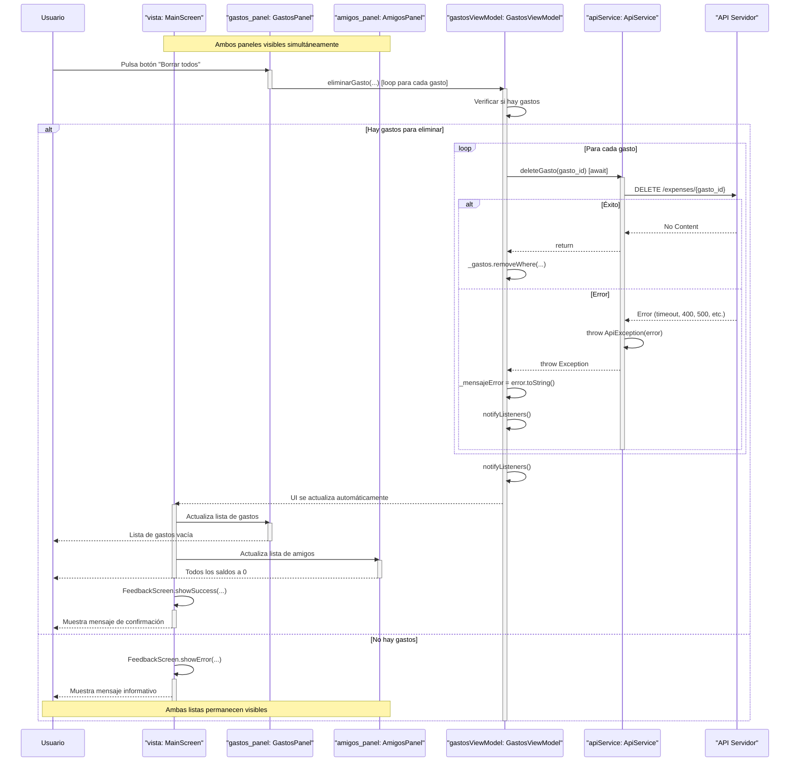
```mermaid
sequenceDiagram
    participant Usuario
    participant Vista as "vista: MainScreen"
    participant GastosPanel as "gastos_panel: GastosPanel"
    participant AmigosPanel as "amigos_panel: AmigosPanel"
    participant GastosViewModel as "gastosViewModel: GastosViewModel"
    participant ApiService as "apiService: ApiService"
    participant API as "API Servidor"

    Note over Vista,AmigosPanel: Ambos paneles visibles simultáneamente

    Usuario->>GastosPanel: Pulsa botón "Borrar todos"
    activate GastosPanel
    GastosPanel->>GastosViewModel: eliminarGasto(...) [loop para cada gasto]
    deactivate GastosPanel
    activate GastosViewModel

    GastosViewModel->>GastosViewModel: Verificar si hay gastos

    alt Hay gastos para eliminar
        loop Para cada gasto
            GastosViewModel->>ApiService: deleteGasto(gasto_id) [await]
            activate ApiService
            ApiService->>API: DELETE /expenses/{gasto_id}
            
            alt Éxito
                API-->>ApiService: No Content
                ApiService-->>GastosViewModel: return
                
                GastosViewModel->>GastosViewModel: _gastos.removeWhere(...)
            else Error
                API-->>ApiService: Error (timeout, 400, 500, etc.)
                ApiService->>ApiService: throw ApiException(error)
                ApiService-->>GastosViewModel: throw Exception
                
                GastosViewModel->>GastosViewModel: _mensajeError = error.toString()
                GastosViewModel->>GastosViewModel: notifyListeners()
            end
            deactivate ApiService
        end
        
        GastosViewModel->>GastosViewModel: notifyListeners()
        GastosViewModel-->>Vista: UI se actualiza automáticamente
        activate Vista
        
        Vista->>GastosPanel: Actualiza lista de gastos
        activate GastosPanel
        GastosPanel-->>Usuario: Lista de gastos vacía
        deactivate GastosPanel
        
        Vista->>AmigosPanel: Actualiza lista de amigos
        activate AmigosPanel
        AmigosPanel-->>Usuario: Todos los saldos a 0
        deactivate AmigosPanel
        
        deactivate Vista
        
        Vista->>Vista: FeedbackScreen.showSuccess(...)
        activate Vista
        Vista-->>Usuario: Muestra mensaje de confirmación
        deactivate Vista
    else No hay gastos
        Vista->>Vista: FeedbackScreen.showError(...)
        activate Vista
        Vista-->>Usuario: Muestra mensaje informativo
        Note over Usuario,AmigosPanel: Ambas listas permanecen visibles
        deactivate Vista
    end

    deactivate GastosViewModel
```

## Secuencia para Actualizar Datos con Concurrencia (Tablet)

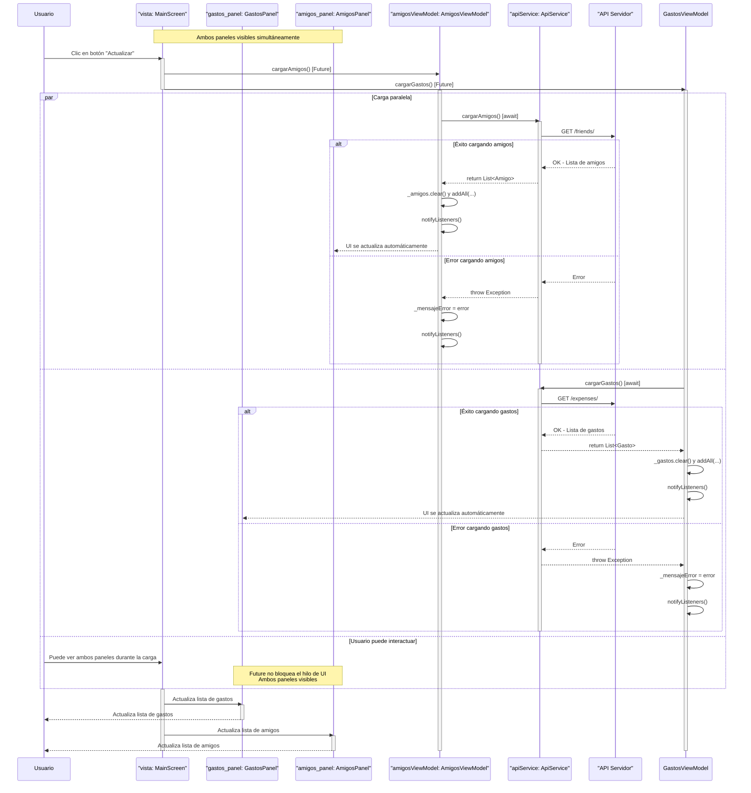
```mermaid
sequenceDiagram
    participant Usuario
    participant Vista as "vista: MainScreen"
    participant GastosPanel as "gastos_panel: GastosPanel"
    participant AmigosPanel as "amigos_panel: AmigosPanel"
    participant AmigosViewModel as "amigosViewModel: AmigosViewModel"
    participant ApiService as "apiService: ApiService"
    participant API as "API Servidor"

    Note over Vista,AmigosPanel: Ambos paneles visibles simultáneamente

    Usuario->>Vista: Clic en botón "Actualizar"
    activate Vista
    Vista->>AmigosViewModel: cargarAmigos() [Future]
    Vista->>GastosViewModel: cargarGastos() [Future]
    deactivate Vista
    activate AmigosViewModel
    activate GastosViewModel
    
    par Carga paralela
        AmigosViewModel->>ApiService: cargarAmigos() [await]
        activate ApiService
        ApiService->>API: GET /friends/
        alt Éxito cargando amigos
            API-->>ApiService: OK - Lista de amigos
            ApiService-->>AmigosViewModel: return List<Amigo>
            AmigosViewModel->>AmigosViewModel: _amigos.clear() y addAll(...)
            AmigosViewModel->>AmigosViewModel: notifyListeners()
            AmigosViewModel-->>AmigosPanel: UI se actualiza automáticamente
        else Error cargando amigos
            API-->>ApiService: Error
            ApiService-->>AmigosViewModel: throw Exception
            AmigosViewModel->>AmigosViewModel: _mensajeError = error
            AmigosViewModel->>AmigosViewModel: notifyListeners()
        end
        deactivate ApiService
    and
        GastosViewModel->>ApiService: cargarGastos() [await]
        activate ApiService
        ApiService->>API: GET /expenses/
        alt Éxito cargando gastos
            API-->>ApiService: OK - Lista de gastos
            ApiService-->>GastosViewModel: return List<Gasto>
            GastosViewModel->>GastosViewModel: _gastos.clear() y addAll(...)
            GastosViewModel->>GastosViewModel: notifyListeners()
            GastosViewModel-->>GastosPanel: UI se actualiza automáticamente
        else Error cargando gastos
            API-->>ApiService: Error
            ApiService-->>GastosViewModel: throw Exception
            GastosViewModel->>GastosViewModel: _mensajeError = error
            GastosViewModel->>GastosViewModel: notifyListeners()
        end
        deactivate ApiService
    and Usuario puede interactuar
        Usuario->>Vista: Puede ver ambos paneles durante la carga
        Note over GastosPanel,AmigosPanel: Future no bloquea el hilo de UI<br/>Ambos paneles visibles
    end
    
    activate Vista
    Vista->>GastosPanel: Actualiza lista de gastos
    activate GastosPanel
    GastosPanel-->>Usuario: Actualiza lista de gastos
    deactivate GastosPanel
    
    Vista->>AmigosPanel: Actualiza lista de amigos
    activate AmigosPanel
    AmigosPanel-->>Usuario: Actualiza lista de amigos
    deactivate AmigosPanel
    
    deactivate Vista
    
    deactivate AmigosViewModel
    deactivate GastosViewModel
```

